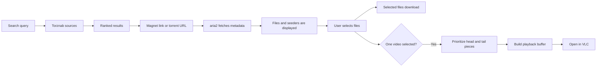

<div align="center">

# Live Torrent Client

**Explore magnet links, choose exactly what you need, and watch videos while they download.**

Python-powered CLI · aria2 BitTorrent engine · VLC progressive playback

</div>

---

Live Torrent Client is a lightweight interactive torrent explorer. Give it a
magnet link and it fetches the torrent metadata, displays the available files
and current seeders, then lets you choose which items to download.

When a single video is selected, the client can prioritize the parts required
for playback and open the file in VLC after building a small buffer.

> Use this software only with content that you are authorized to download and
> share.

## Features

- Interactive mode when no command-line arguments are provided
- Magnet metadata inspection before downloading content
- Parallel searches through Jackett, Prowlarr, or any Torznab-compatible source
- Result deduplication and automatic sorting by seeder count
- Current seeder count and numbered file listing
- Individual, multiple, range, or full-torrent file selection
- Custom download directory
- Metadata-only inspection mode
- Configurable metadata timeout
- Progressive video playback through VLC
- No third-party Python packages
- Clear errors for missing tools, unavailable peers, and invalid selections

## How it works



The Python script manages the interactive experience and communicates with a
local aria2 process through JSON-RPC. aria2 handles BitTorrent networking, DHT,
peer exchange, metadata, and file selection. VLC is only required when the
progressive playback option is used.

Searches use the open Torznab protocol. This allows the same client to work with
Jackett, Prowlarr, NZBHydra2, and other compatible services without executing
untrusted third-party Python plugins.

## Requirements

| Tool | Required for | Version |
| --- | --- | --- |
| Python | Running the client | 3.10 or newer |
| aria2c | Torrent metadata and downloads | 1.37 recommended |
| VLC | Watching a video while it downloads | Latest stable version |

Official downloads:

- [Python](https://www.python.org/downloads/)
- [aria2](https://aria2.github.io/)
- [VLC](https://www.videolan.org/vlc/)

## Installation

### Windows

Install aria2 with Windows Package Manager:

```powershell
winget install --id aria2.aria2 --exact
```

Install VLC if you want progressive video playback:

```powershell
winget install --id VideoLAN.VLC --exact
```

Clone the repository and enter its directory:

```powershell
git clone https://github.com/YOUR_USERNAME/live-torrent-client.git
cd live-torrent-client
```

Install the small set of dependencies required by some community plugins:

```powershell
python -m pip install -r requirements.txt
```

## Search setup

Search works immediately with the locally stored plugins. Torznab configuration
is optional and adds Jackett, Prowlarr, or other compatible sources to the same
result list. Direct magnet links also work without any search configuration.

For broad tracker coverage, install [Jackett](https://github.com/Jackett/Jackett)
or [Prowlarr](https://github.com/Prowlarr/Prowlarr), then configure the indexers
you are authorized to use.

Copy the example configuration:

```powershell
Copy-Item search_engine\search_config.example.json search_config.json
```

Open `search_config.json` and provide the Torznab endpoint and API key. A Jackett
configuration looks like this:

```json
{
  "sources": [
    {
      "name": "Jackett",
      "url": "http://127.0.0.1:9117/api/v2.0/indexers/all/results/torznab/api",
      "api_key": "YOUR_JACKETT_API_KEY",
      "enabled": true
    }
  ]
}
```

The API key is shown in the Jackett web interface, normally available at
`http://127.0.0.1:9117`. The local `search_config.json` file is ignored by Git so
API keys are not committed accidentally.

Multiple sources and local plugins are searched concurrently. Duplicate results
are merged by title and size, magnet links are preferred, and results are ranked
by seeder count. A failed or outdated plugin produces a warning without stopping
the remaining search.

When qBittorrent is installed, Live Torrent Client first uses the plugins from
its local Nova3 profile. This preserves plugin-specific JSON settings and uses
the same engine versions as qBittorrent. Stored project plugins then add any
search engines missing from that profile. Engines with the same module name are
not executed twice.

### Linux

On Debian or Ubuntu:

```bash
sudo apt update
sudo apt install aria2 vlc python3
```

### macOS

Using Homebrew:

```bash
brew install aria2
brew install --cask vlc
```

## Quick start

Install the Python dependencies and start the graphical client:

```powershell
pip install -r requirements.txt
python main.py
```

The desktop interface includes torrent search, metadata exploration, multi-file
selection, live transfer statistics, output-folder settings, and VLC streaming.
All network and download work runs outside the interface thread, so the window
remains responsive while engines and peers are contacted.

## Command-line interface

The original guided terminal client remains available separately:

```powershell
python main-cli.py
```

The client now offers two actions:

```text
What would you like to do?
[1] Open a magnet link
[2] Search for torrents
Select:
```

Paste a magnet link when prompted:

```text
Paste the magnet link: magnet:?xt=urn:btih:...
```

After the metadata is received, the client displays the torrent contents:

```text
Torrent: Example collection
Current seeders: 12
Files: 4

[  1] Example collection\video.mp4 (1.4 GB)
[  2] Example collection\subtitles.en.srt (48.2 KB)
[  3] Example collection\cover.jpg (320.5 KB)
[  4] Example collection\README.txt (2.1 KB)
```

Choose files by entering their numbers separated by spaces:

```text
Select: 1 2
```

Supported selection formats:

| Input | Result |
| --- | --- |
| `1` | Download file 1 |
| `1 3 5` | Download files 1, 3, and 5 |
| `2-6` | Download files 2 through 6 |
| `1 3-5 8` | Combine individual files and ranges |
| `all` | Download every file |

## Watching while downloading

When exactly one supported video is selected, the client asks:

```text
Watch while downloading? [y/N]:
```

Answer `y` to enable progressive playback. The client will:

1. Prioritize the first and last pieces of the video.
2. Keep a moving 32 MB priority window ahead of the contiguous downloaded data.
3. Download a contiguous playback buffer of at least 64 MB (up to 256 MB for
   large videos) before opening VLC.
4. Open the incomplete file in VLC.
5. Continue expanding the prioritized area while the video plays.

After one file finishes, selecting another file from the same torrent creates a
fresh aria2 task automatically. This allows consecutive downloads and streaming
sessions without reusing an already completed transfer.

VLC is mandatory for this mode because the default Windows media player does
not reliably handle incomplete files. If VLC is missing, the client stops and
shows the official installation link.

Supported video extensions include `.mp4`, `.mkv`, `.avi`, `.mov`, `.webm`,
`.mpeg`, `.mpg`, `.m4v`, `.wmv`, and `.ts`.

> Playback depends on torrent speed, seeder availability, video bitrate, and
> file structure. If playback catches up with the download, pause briefly to
> allow the buffer to grow.

## Command reference

```text
usage: main-cli.py [-h] [--search QUERY] [--search-config SEARCH_CONFIG]
               [--search-timeout SEARCH_TIMEOUT] [--max-results MAX_RESULTS]
               [-o OUTPUT] [--list-only]
               [--metadata-timeout METADATA_TIMEOUT]
               [magnet]
```

### Search for torrents

```powershell
python main-cli.py --search "ubuntu linux"
```

Search results show title, size, seeders, leechers, and source. After a result is
selected, the normal metadata explorer opens automatically.

To use a different configuration or show more results:

```powershell
python main-cli.py --search "ubuntu" --search-config "my-sources.json" --max-results 100
```

Each source has a 30-second search timeout by default. Change it with:

```powershell
python main-cli.py --search "ubuntu" --search-timeout 60
```

### Pass the magnet directly

```powershell
python main-cli.py "magnet:?xt=urn:btih:..."
```

Always quote magnet links because they commonly contain `&` characters that
shells may interpret.

### Choose the output directory

```powershell
python main-cli.py "MAGNET" --output "D:\Torrents"
```

The default output directory is `downloads` inside the project folder.

### Inspect without downloading

```powershell
python main-cli.py "MAGNET" --list-only
```

This fetches the metadata and lists the torrent contents without downloading
the selected content.

### Change the metadata timeout

```powershell
python main-cli.py "MAGNET" --metadata-timeout 300
```

The default timeout is 120 seconds. Use `0` to wait indefinitely:

```powershell
python main-cli.py "MAGNET" --metadata-timeout 0
```

### Show help

```powershell
python main-cli.py --help
```

## Troubleshooting

### `aria2c was not found`

Install aria2, then restart the terminal so the updated `PATH` is loaded:

```powershell
winget install --id aria2.aria2 --exact
```

On Windows, the client also searches the default WinGet package directory.

### Metadata request timed out

This usually means the magnet is invalid, the torrent has no reachable peers,
or network traffic is being blocked. Check:

- Whether the complete magnet link was copied
- Seeder availability
- Firewall and antivirus rules
- VPN or proxy configuration
- Whether DHT and peer-to-peer traffic are allowed on the network

You can also increase `--metadata-timeout`.

### Search configuration was not found

Copy the example and add your Torznab endpoint and API key:

```powershell
Copy-Item search_engine\search_config.example.json search_config.json
```

### A search source reports an error

Confirm that Jackett, Prowlarr, or the configured Torznab service is running.
Check its endpoint, API key, indexer health, and firewall settings. One failed
source does not discard successful results returned by other sources.

### VLC was not found

VLC is required only for progressive playback. Install it from the
[official VideoLAN website](https://www.videolan.org/vlc/) or with WinGet:

```powershell
winget install --id VideoLAN.VLC --exact
```

### Playback pauses or stutters

The player may be consuming data faster than the torrent can download it. Wait
for more buffer, choose a torrent with more seeders, or let the download finish.

## Project structure

```text
live-torrent-client/
├── main.py           # Modern desktop GUI wrapper
├── main-cli.py       # Core client, CLI, aria2 RPC, and VLC playback
├── search_engine/
│   ├── torznab.py                 # Parallel Torznab search and normalization
│   ├── plugin_runner.py           # Isolated local plugin orchestration
│   ├── plugin_worker.py           # Single-plugin subprocess worker
│   ├── nova_runtime/              # qBittorrent Nova3 compatibility runtime
│   ├── search_config.example.json # Safe search configuration template
│   ├── catalogs/                  # Trusted and community source catalogs
│   └── plugins/                   # Official and downloaded community plugins
├── README.md         # Project documentation
├── requirements.txt # Notes about Python dependencies
└── .gitignore        # Generated and local-only files
```

## Development

Run a syntax check:

```powershell
python -m py_compile main.py main-cli.py
```

The core client uses the standard library. CustomTkinter provides the desktop
interface, while some community search plugins require Beautiful Soup or lxml.
These Python packages are listed in `requirements.txt`; aria2 and VLC remain
external runtime tools.

Public community plugin snapshots can be refreshed without executing them:

```powershell
python search_engine\download_plugins.py
```

Each download is syntax-checked and recorded with its original URL and SHA-256
hash. Plugins are third-party code and still require review before execution.

## Contributing

Issues and pull requests are welcome. Keep changes focused, document user-facing
behavior, and test the interactive flow on the target operating system.

## Legal notice

BitTorrent is a general-purpose file distribution protocol. You are responsible
for ensuring that your use of this client complies with applicable laws and the
rights of content owners.
